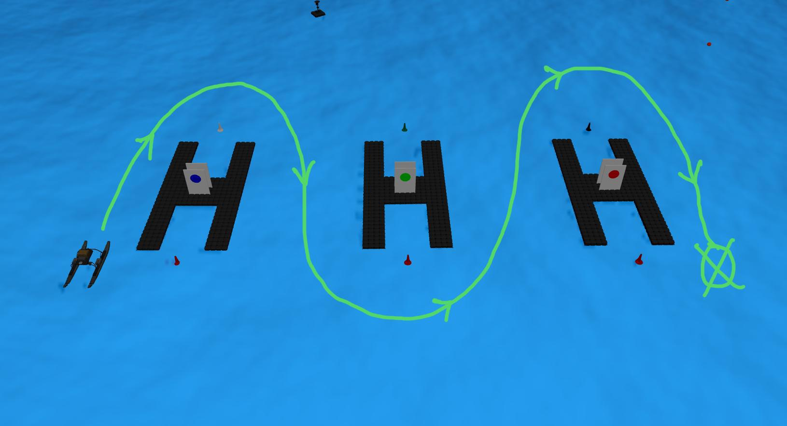

# Virtual RobotX (VRX)
This repository is the home to the source code and software documentation for the VRX simulation environment, which supports simulation of unmanned surface vehicles in marine environments.
* Designed in coordination with RobotX organizers, this project provides arenas and tasks similar to those featured in past and future RobotX competitions, as well as a description of the WAM-V platform.
* For RobotX competitors this simulation environment is intended as a first step toward developing tools prototyping solutions in advance of physical on-water testing.
* We also welcome users with simulation needs beyond RobotX. As we continue to improve the environment, we hope to offer support to a wide range of potential applications.

---
## Introduction
Research for autonomous navigation in the field of wheeled mobile robotics dates back to 1950’s and has grown quite strong in the past decade with advancement of computation power, availability of low-cost sensors and most importantly the large open-source community, whereas research in maritime robotics is younger comparatively mostly because of the challenges and large number of parameters to deal with when interacting with water. In this report I demonstrate autonomous navigation using a USV in an unknown (no pre-built map) water lake simulated environment. This small project is for the final selection round for a remote internship at the Autonomous Engineers Private Limited (AEPL), India.

## Obstacle Avoidance and Navigation using move_base
1. Create workspace and setup repo
```bash
mkdir -p ~/vrx_ws/src
cd ~/vrx_ws/src
git clone https://github.com/YashKSahu/vrx
source /opt/ros/noetic/setup.bash
```
2. Compile and Run
```bash
cd ~/vrx_ws
catkin_make
source  ~/vrx_ws/devel/setup.bash
roslaunch vrx_gazebo vrx.launch
```
3. Bringup
- This launch file containes the basic nodes for the USV.
  - robot state publisher
  - joint state publisher
  - tf
  - localization
  - odom filter node
  - odom tf
  - point cloud to laser scan
```bash
roslaunch vrx_gazebo bringup.launch
```
4. Thrust to Twist
- Most ROS packages are written w.r.t wheeled robots, and hence the parameters are also in accordance to it. A USV doesnt have wheels but thrusters instead to push it in water current. VRX has provided a thrust2twist node to convert thrust commands to equivalent geometry twist commands.
```bash
roslaunch vrx_gazebo usb_keydrive.launch
```
5. move_base Obstacle Avoidance
- I found three different ways of performing autonomous navigation
  - With a pre-built known map
    - gmapping for building map and then amcl and move_base to navigate
  - Building and saving map simulataneously while autonomously navigating and exploring envrionment
    - slam and move_base to map and navigate simultaneously 
    - or RTAB Map and move_base
  - Without a known map, mapless navigation
    - just pure move_base navigation, obstacles are avoided on exploration but map and obstacle information is lost globally

```bash
roslaunch vrx_gazebo move_base.launch
```
6. Give a 2d navigation goal from rviz

https://user-images.githubusercontent.com/66440615/210404657-53dafc8c-5722-41f0-9815-c30e0c1113bd.mp4

7. Lawn Mower Navigation Script
This script can work for both with and without obstacle cases, as only move_base is running in backround to send navigation goals to controllers.
```bash
rosrun vrx_gazebo navigation_goal.cpp
```


- currently stuck on this error due to low cpu power 
```bash
Map update loop missed its desired rate of 4.0000Hz... the loop actually took 1.4040 seconds.
Aborting because a valid plan could not be found. Even after executing all recovery behaviors
```
---

## Reference

If you use the VRX simulation in your work, please cite our summary publication, [Toward Maritime Robotic Simulation in Gazebo](https://wiki.nps.edu/display/BB/Publications?preview=/1173263776/1173263778/PID6131719.pdf): 

```
@InProceedings{bingham19toward,
  Title                    = {Toward Maritime Robotic Simulation in Gazebo},
  Author                   = {Brian Bingham and Carlos Aguero and Michael McCarrin and Joseph Klamo and Joshua Malia and Kevin Allen and Tyler Lum and Marshall Rawson and Rumman Waqar},
  Booktitle                = {Proceedings of MTS/IEEE OCEANS Conference},
  Year                     = {2019},
  Address                  = {Seattle, WA},
  Month                    = {October}
}
```
- https://github.com/disaster-robotics-proalertas/usv_sim_lsa
- https://www.leorover.tech/guides/autonomous-navigation
- http://wiki.ros.org/navigation/Tutorials/RobotSetup
- https://git.scc.kit.edu/ugdrv/husky/-/tree/hokuyo
- https://github.com/Tinker-Twins/Husky
- https://geo-matching.com/usvs-unmanned-surface-vehicles/wam-v-16-asv
- http://wiki.ros.org/move_base
- https://answers.ros.org/question/351267/advice-for-slam-with-3d-lidar/
- http://wiki.ros.org/gmapping
- https://answers.ros.org/question/195523/warning-map-update-loop-missed-its-desired-rate-keeps-on-comming/
- http://wiki.ros.org/husky_navigation/Tutorials/Husky%20Move%20Base%20Demo
- https://www.youtube.com/watch?v=3sVrWRfWrEY
- https://robonation.org/app/uploads/sites/2/2021/11/VRX2022_Technical-Guide_v1.1.pdf
- vrx wiki
- https://github.com/YashKSahu/Localization-and-Mapping-in-ROS/blob/main/yobot/src/navigation_goal.cpp

## Contributing
This project is under active development to support the VRX and RobotX teams. We are adding and improving things all the time. Our primary focus is to provide the fundamental aspects of the robot and environment, but we rely on the community to develop additional functionality around their particular use cases.

If you have any questions about these topics, or would like to work on other aspects, please contribute.  You can contact us directly (see below), submit an [issue](https://github.com/osrf/vrx/issues) or, better yet, submit a [pull request](https://github.com/osrf/vrx/pulls/)!

## Contributors

We continue to receive important improvements from the community.  We have done our best to document this on our [Contributors Wiki](https://github.com/osrf/vrx/wiki/Contributors).

## Contacts

 * Carlos Aguero <caguero@openrobotics.org>
 * Michael McCarrin <mrmccarr@nps.edu>
 * Brian Bingham <bbingham@nps.edu>
